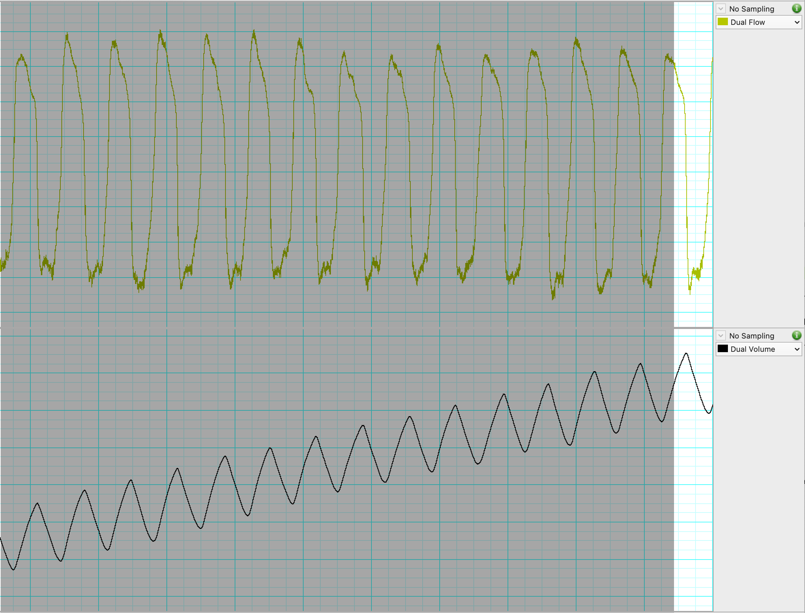
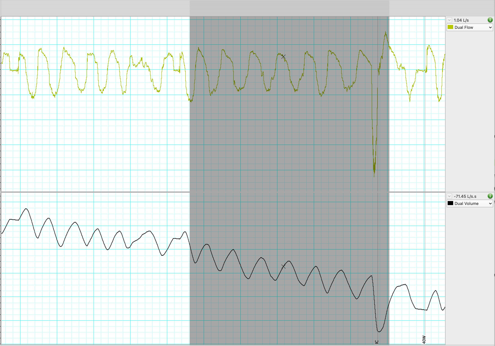
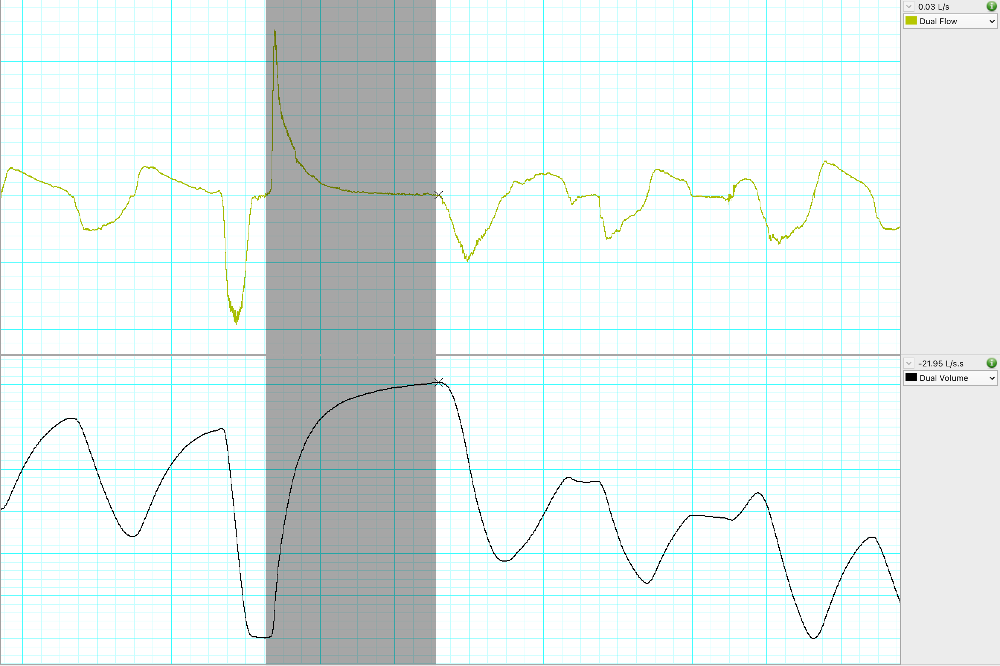

# Grand Numerical Analysis of Respiration

## About GNAR
Grand Numerical Analysis of Respiration or GNAR is a program created to identify and quantify expiratory flow limitation during exercise. 
The program takes time series data from data acquisition softwares such as LabChart and separates and averages each breath.

**GNAR pipeline:**
* Composite MEFV curve is created from graded FVC maneouvers (see )
* Volume drift is corrected 
* Breaths are separated and averaged
* IC is calculated to determine placement of exercise FV loops in the MEFV curve
* The presence of EFL is determined by the presence and magnitude of overlap of the MEFV curve and FV loop

Aspects of this code is adapted from  which is a great analysis tool for analysing respiratory mechanics such as work of breathing and diaphragm EMG recorded with an esophageal balloon catheter. I am currently working on integrating GNAR into the RespMech pipeline.

Please note, I am a researcher first, programmer second. I learned python for the purpose of this project so the code may be inefficient at times. Please reach out if you find issues or areas that can be improved or want assistance with your use case!

## Set up
Close this repository and open with your preferred Python IDE (I use VScode) running Python 3.12+.
The **gnar.py** file contains the analysis code.
The **spirometry.py** file is a module integrated into the gnar.py code but can function as a stand alone library creation and analysis of MEFV curves (see below for more info).
The **settings.py** is where data will be inputted, analysis and output settings are adjusted, and where gnar.py is executed.

## Input
The program takes time series data of time, flow, and volume collected using data acquisition software (code is designed to work seamlessly with LabChart exported .txt files). Export data into the folders specified below with two .txt files for each stage (one in "breaths" and one in "ic") and as many FVC manoevers as collected.
# Input folder
The input folder must match the example folder provided in the repo, the folder name is typically the participant/study ID and contains three sub folders where the time series .txt files will be located and an 'output' folder with sub folders "data" and "figures".

To allow for the code to run each stage of exercise in order, for the breaths and ic files use sequential 3 digit numbering (I use the watts for that stage of exercise) for example, participantID_B020W.txt or participantID_IC160W.txt.

**Time series data (only export time, flow, volume):**

* The "breaths" folder should contain ~30 seconds of fairly clean breaths towards the end of that stage of exercise (ideally last 30 seconds). Do not include the IC breath in this. Start selection on an inspiration and end on an expiration as shown .

* The "ic" folder should contain ~30 seconds of fairly clean breaths AND the IC breath, starting on an inspiration and ending mid way on the expired breath directly following the IC breatg as shown .

* The "fvc" folder should contain a number of graded fvc manoevers before and after exercise (I used 8 pre and 8 post). Select from the lowest point on the volume trace (should be the zero crossing on flow trace) to the highest point on the volume trace (flow should again be 0) as shown .

## Running the code
In the **settings.py** file, add the path to your input folder as such:

'''
"inputfolder": r'/Users/jackdunsford/Library/CloudStorage/OneDrive-Personal/Thesis/01-220/V2 gnarpy',
'''

## Output
By default, the code will output three figures,  